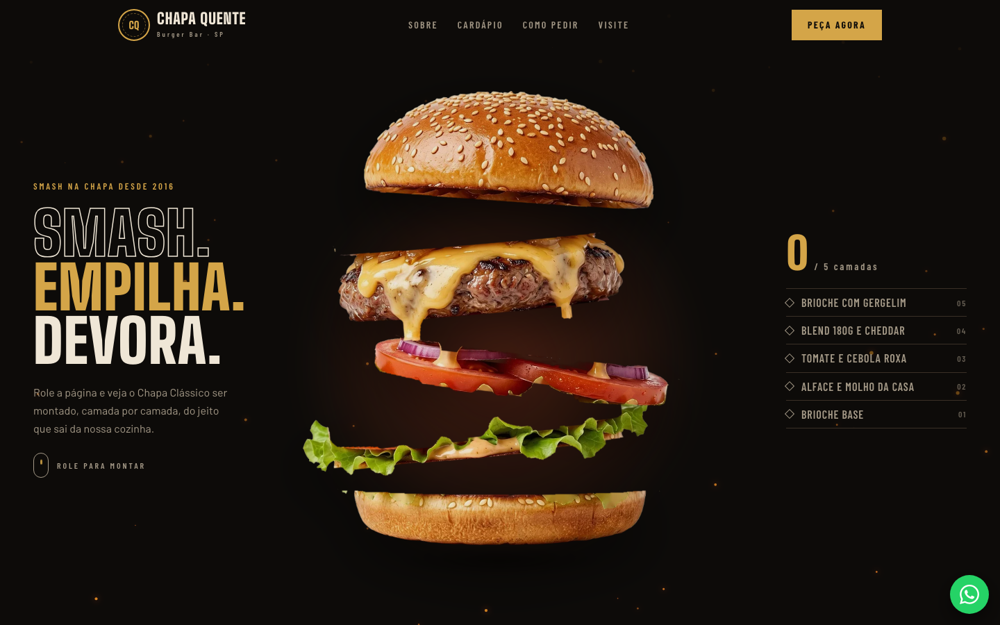
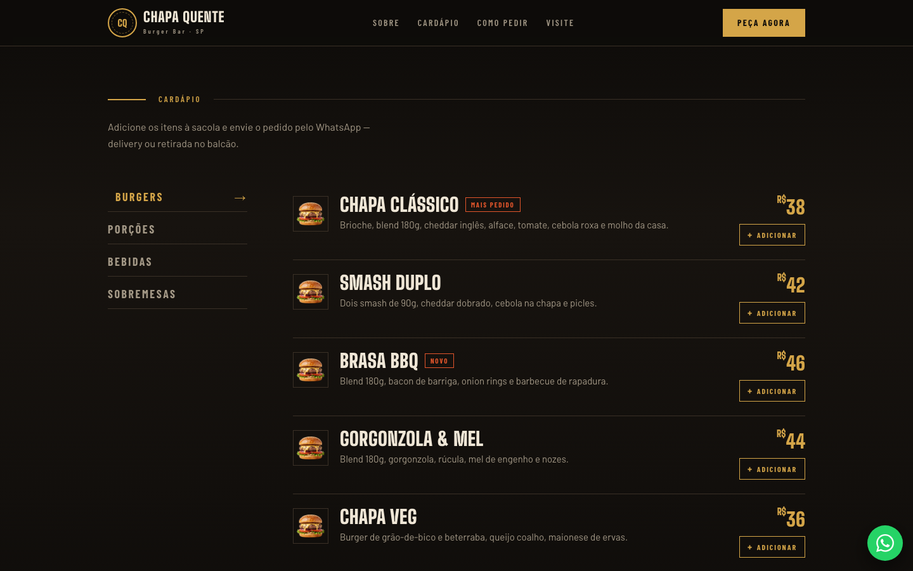
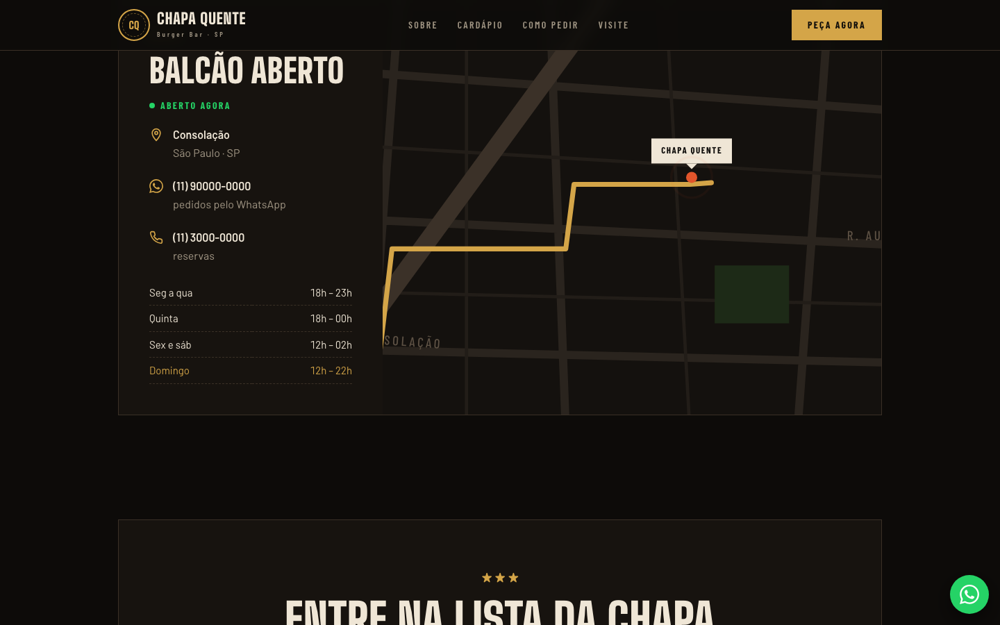
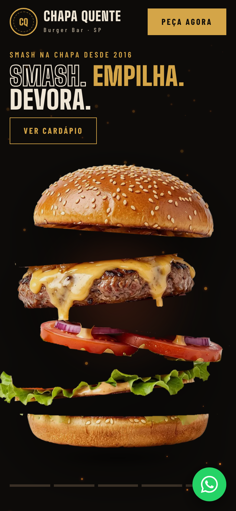

# Chapa Quente Burgers

> Projeto criado para complementar o meu portfólio pessoal: **[portifolio-heitor.vercel.app](https://portifolio-heitor.vercel.app/)**
>
> A Chapa Quente é uma hamburgueria fictícia — nomes, telefones e endereço são só para demonstração.

Landing page de uma hamburgueria artesanal em São Paulo. O site apresenta a casa, o cardápio e a forma de pedir,
e deixa o cliente montar o pedido direto na página e enviá-lo pelo WhatsApp.

## O que tem no site

- **Hambúrguer que se monta na rolagem** — no topo, o Chapa Clássico é montado camada por camada conforme a página desce.
- **Cardápio com sacola** — burgers, porções, bebidas e sobremesas; o cliente adiciona os itens e a sacola fica salva no navegador.
- **Pedido pelo WhatsApp** — a sacola vira uma mensagem formatada e abre direto a conversa com a loja.
- **Horário de funcionamento ao vivo** — o site mostra se o balcão está aberto agora, junto com endereço e mapa.
- **Responsivo** — pensado para funcionar bem no celular, onde a maioria dos pedidos acontece.

  

## Tecnologias

React 19, TypeScript, Tailwind CSS v4 e Vite.

## Acesse o site

**[chapa-quente-six.vercel.app](https://chapa-quente-six.vercel.app/)**
